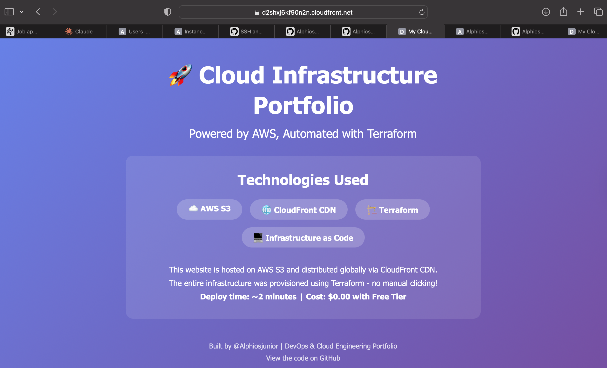
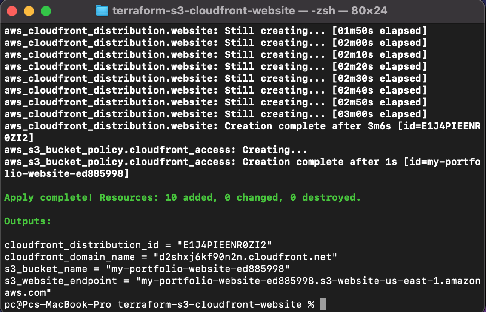

# 🌐 AWS S3 + CloudFront Static Website

Professional static website deployment using AWS S3 and CloudFront CDN, fully automated with Terraform.

## 🚀 Project Overview

This project demonstrates modern web hosting architecture by deploying a static website using:

- **AWS S3** for storage
- **CloudFront CDN** for global content delivery
- **Terraform** for complete infrastructure automation

## 🏗️ Architecture

```
HTML/CSS Website Files
        ↓
    S3 Bucket (Storage)
        ↓
CloudFront CDN (Global Distribution)
        ↓
    HTTPS Website URL
```

## 🛠️ Technologies Used

- **AWS S3** - Object storage and static website hosting
- **AWS CloudFront** - Content Delivery Network (CDN)
- **Terraform** - Infrastructure as Code (IaC)
- **HTML/CSS** - Frontend design

## ✨ Key Features

- ✅ Fully automated infrastructure deployment
- ✅ Global content delivery via CloudFront CDN
- ✅ HTTPS enabled by default
- ✅ Cost-optimized (PriceClass_100 - North America & Europe only)
- ✅ Origin Access Control for secure S3 access
- ✅ Custom error page handling
- ✅ Infrastructure as Code - reproducible and version-controlled

## 📋 Infrastructure Components

| Resource                | Purpose              | Configuration                               |
| ----------------------- | -------------------- | ------------------------------------------- |
| S3 Bucket               | Website file storage | Public read access, website hosting enabled |
| CloudFront Distribution | Global CDN           | HTTPS redirect, caching enabled             |
| Origin Access Control   | Security             | Secure CloudFront-to-S3 connection          |
| Bucket Policy           | Permissions          | Public read access for website files        |

## 🚀 Deployment

```bash
# Initialize Terraform
terraform init

# Preview changes
terraform plan

# Deploy infrastructure
terraform apply

# Destroy infrastructure (stop costs)
terraform destroy
```

## 💰 Cost Analysis (ZAR)

### Free Tier Coverage:

- **S3 Storage**: First 5 GB free (website ~10 MB)
- **S3 Requests**: 20,000 GET requests free/month
- **CloudFront**: 1 TB data transfer free/month
- **CloudFront**: 10M HTTP requests free/month

### Estimated Monthly Cost:

- **If kept running**: ~R9.00-R18.00/month
- **Deploy-test-destroy**: ~R0.00-R0.54

**My approach**: Deploy → Test → Screenshot → Destroy = **R0.00**

### Detailed Cost Breakdown (ZAR):

| Item                     | Free Tier      | Cost After Free Tier    |
| ------------------------ | -------------- | ----------------------- |
| S3 Storage               | First 5GB free | ~R0.41/GB/month         |
| S3 PUT Requests          | 2,000 free     | ~R0.09/1,000 requests   |
| S3 GET Requests          | 20,000 free    | ~R0.007/1,000 requests  |
| CloudFront Data Transfer | 1TB free/month | ~R1.80/GB               |
| CloudFront HTTP Requests | 10M free/month | ~R0.018/10,000 requests |
| CloudFront Distribution  | Minimal        | ~R9.00/month base cost  |

**Currency Note**: Costs based on approximate USD/ZAR exchange rate of R18.00 = $1.00

### Why So Cheap?

- Website files are tiny (~10 MB vs 5 GB free tier)
- Portfolio sites have low traffic (well within free tier limits)
- CloudFront base cost only applies if kept running
- Destroyed infrastructure = R0.00 cost

## 📊 Deployment Results

- **Deployment Time**: ~8 minutes
- **CloudFront Distribution ID**: E1J4PIEENR0ZI2
- **Resources Created**: 10 (S3 bucket, CloudFront distribution, policies, etc.)
- **Website URL**: `https://d2shxj6kf90n2n.cloudfront.net` (now destroyed)
- **Global CDN**: Content cached at edge locations worldwide
- **Total Cost**: R0.00 (deployed and destroyed within 1 hour)

## 📸 Screenshots

### Live Website



### Terraform Outputs



### AWS S3 Bucket


### CloudFront Distribution


## 🎓 What I Learned

- **S3 Static Website Hosting**: Configuring buckets for web hosting
- **CloudFront CDN**: Setting up global content delivery and understanding edge locations
- **Origin Access Control**: Modern security patterns replacing legacy OAI
- **Terraform Resource Dependencies**: Managing complex infrastructure relationships
- **Cost Optimization**: Leveraging free tier and choosing optimal price classes
- **Infrastructure as Code**: Building reproducible, version-controlled infrastructure
- **AWS Pricing**: Understanding cloud cost structures and optimization strategies

## 🔒 Security Best Practices

- ✅ Origin Access Control (OAC) instead of deprecated OAI
- ✅ HTTPS-only viewer protocol (redirect HTTP to HTTPS)
- ✅ Bucket policy restricted to CloudFront service principal
- ✅ No hardcoded credentials in code
- ✅ No sensitive data in public repositories
- ✅ Proper IAM permissions for Terraform user

## 🚀 CI/CD Pipeline

### Automated Deployment with GitHub Actions

Every push to `main` branch automatically:

1. ✅ Runs Terraform plan
2. ✅ Deploys infrastructure
3. ✅ Outputs CloudFront URL

### How It Works:

**Workflow File**: `.github/workflows/deploy.yml`

```
Developer Push
    ↓
GitHub Actions Triggered
    ↓
Terraform Init
    ↓
Terraform Apply
    ↓
Infrastructure Deployed
    ↓
Website Live ✅
```

### Current Live Website:

**URL**: https://dtlieoihekups.cloudfront.net

**Last Deployed**: [Date]

## 🔄 Reproducibility

Anyone can recreate this infrastructure by:

1. Cloning this repository
2. Configuring AWS credentials (`aws configure`)
3. Running `terraform init`
4. Running `terraform apply`

The entire stack deploys in ~8 minutes and costs R0.00 if destroyed within an hour!

## 🎯 Use Cases

This architecture is perfect for:

- Portfolio websites
- Documentation sites
- Landing pages
- Marketing websites
- Static blogs (Jekyll, Hugo, etc.)
- Single Page Applications (SPAs)
- Company brochure sites

## 🌍 Global Performance

CloudFront distributes content from edge locations worldwide, providing:

- **Low latency** for users in South Africa, Europe, and Americas
- **Fast load times** regardless of user location
- **DDoS protection** built into CloudFront
- **Automatic failover** and high availability

## 📈 Project Metrics

- **Lines of Terraform Code**: ~200
- **Deployment Time**: 8 minutes
- **Destruction Time**: 5 minutes
- **Resources Managed**: 10 AWS resources
- **Infrastructure Cost**: R0.00 (with deploy-destroy strategy)
- **Learning Time**: 1-2 hours

## 🚀 Future Enhancements

Potential improvements for this project:

- [ ] Add custom domain with Route53 (~R18/month)
- [ ] Implement SSL certificate with AWS Certificate Manager (Free!)
- [ ] Add CloudFront Functions for URL rewrites
- [ ] Integrate CI/CD pipeline with GitHub Actions
- [ ] Add CloudWatch monitoring and alarms
- [ ] Implement automated cache invalidation
- [ ] Add WAF (Web Application Firewall) for security
- [ ] Create multiple environments (dev, staging, prod)

## 👨‍💻 Author

**Alphiosjunior**  
Aspiring Cloud Engineer | DevOps Enthusiast  
Cape Town, South Africa 🇿🇦

**GitHub**: [github.com/Alphiosjunior](https://github.com/Alphiosjunior)  
**Email**: ngqeleiviwe@gmail.com

## 🔗 Related Projects

- [AWS Infrastructure Automation with Terraform](https://github.com/Alphiosjunior/terraform-aws-infrastructure) - EC2, S3, Security Groups

## 📝 License

This project is open source and available under the MIT License.

---

## 💡 Key Takeaways

1. **Infrastructure as Code works**: Entire website deployed with one command
2. **Cloud is affordable**: R0.00 cost with smart resource management
3. **CDN matters**: Global performance without global infrastructure costs
4. **Terraform is powerful**: Complex infrastructure becomes simple, reproducible code
5. **Free tier is generous**: Perfect for learning and portfolio projects

---

**⭐ If you found this helpful, please star the repository!**
